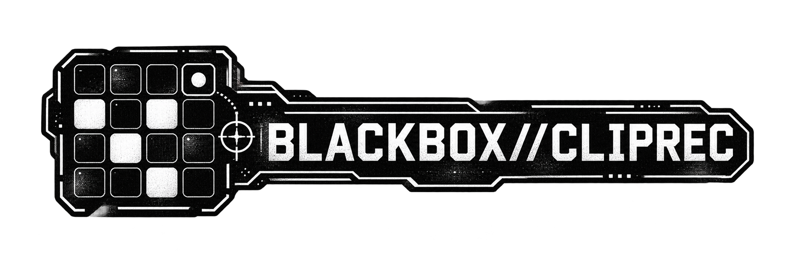

<p align="center"></p>

# Blackbox Clip Recording

An unofficial firmware mod for the **original 1010music Blackbox** that brings back clip-launch recording: arm a PADS
sequence, play your Toggle clips on and off, and the sequence plays your performance back. Record again to add more.
It's a session-view way of building whole songs on the Blackbox.

Built on stock firmware **3.1.9**, so you keep everything in 3.1.9. It changes nothing else.

**Patcher (in your browser): <https://de-pattern.github.io/blackbox-cliprec/>**

## What it does

Before 3.0 the Blackbox could, roughly, record clip launches into a sequence. 3.x records each tap on a pad as its own
short note, so a clip you turned on and off comes back as two blips. With this mod:

- **Each take is one note.** Tap a Toggle clip on, tap it off later. The sequence gets one note covering exactly the
  time the clip played, from where it launched to where it stopped. Both ends sit on the clip's Quant Size grid,
  because that is when the clip actually starts and stops.
- **Recording again only adds** (overdub, like MIDI overdub in Ableton or live recording on an MPC):
  - A take that overlaps or touches an earlier note of the same clip joins it into one note.
  - Recording never shortens or deletes anything. To remove or trim, use the sequence editor as usual.
  - Tapping a clip the sequence is already playing stops it live and leaves the pattern alone. Your next tap starts
    a new take as normal.
- **While you hold a take open**, the sequence's earlier notes for that clip can't cut it off or restart it.
- **A clip left on for a whole loop or more** becomes a note covering the whole loop.
- **Clips still on when you stop recording** are written up to that point.

Everything else is stock: Trigger and Gate pads, KEYS and MIDI sequences, editing, playback and Song mode.

## Using it

1. Set the clips you want to perform with to **Clip** mode, **Launch Mode: Toggle**, with a **Quant Size** (1 bar
   is a good start).
2. Use a sequence in **PADS** mode. Any length and step size works.
3. In the sequence, hold **REC** and press **PLAY**, then go to the PADS screen and play your clips on and off.
4. Stop recording, look at the sequence, then record more passes on top. Save the preset when you're happy.

Tips:

- Count a take from when the clip actually starts, which is the next grid line after your tap, not the tap itself.
- Long arrangements work well: a 256-step sequence gives you 16 bars of 1/16 steps to perform into.

## Install

1. Download **blackbox 3.1.9** from <https://1010music.com/downloads> and unzip it. You need the `BLACKBOX.bin` inside.
2. Patch it, either way:
   - **In your browser:** <https://de-pattern.github.io/blackbox-cliprec/>. Your file never leaves your computer.
   - **With Python 3:** `python3 apply.py path/to/BLACKBOX.bin` → `out/blackbox-cliprec-4.1.0/BLACKBOX.bin`
3. Keep the stock `BLACKBOX.bin` somewhere safe. That file is your way back.
4. Copy the patched `BLACKBOX.bin` to the root of the Blackbox's microSD card. Install it the way you install any
   1010music firmware update: hold BACK + INFO while powering on.
5. TOOLS should show version `4.1.0`.

**To go back to stock:** put the stock `BLACKBOX.bin` on the card and install it the same way. The mod stores nothing
in your presets beyond ordinary sequence notes, so presets keep working on stock firmware.

The patcher checks your file's SHA-256 before it writes anything
(`281ae303d32e5eb52adca7817a648a34e4bd3848017f26673dd9df3905f1341d`) and checks the result afterwards. It only works
on 3.1.9.

## Known limits

- Only **Toggle** pads in **PADS** sequences are recorded this way. Clip-mode pads use their Quant Size grid; Toggle
  pads in other modes are recorded exactly where you tap.
- Positions assume a sequence started on a bar line, which REC+PLAY always does. It also assumes 4/4.
- A clip you tap on and then off again before its next grid line writes nothing, because it never played.

## Build from source

Needs `arm-none-eabi-gcc` and Python 3. Put your stock image at `firmware/BLACKBOX-3.1.9.bin` (see
`firmware/README.md`).

```
./build.sh
python3 patch.py cliprec cave
```

That writes `out/cliprec+cave/BLACKBOX.bin`, byte-identical to the release. `python3 make_patch.py <image> <version>`
turns an image into the release patch in `docs/`.

## How it works

The stock image is left as it is. The new code (`src/`, about 2 KB) is compiled and appended after it. Six places in
the stock firmware (`patches/cliprec.py`) are pointed at the new code:

- **The app's live recorder:** presses on Toggle pads open and close takes instead of writing blips.
- **The app's event pump:** when recording stops, takes still open are written.
- **Both pad engines' handlers for sequencer note on / off:** these are skipped for a pad while its take is open.

Each take is placed the way the stock recorder places a note, in pattern ticks (960 per step), on the clip's launch
grid. It is then joined with any notes of the same pad it overlaps. The source comments in `src/cliprec.c` explain
the details.

## What is and isn't in this repository

In it: original source code, patch definitions (addresses and replacement bytes) and tools.

Not in it, and please don't add it in issues, pull requests or forks: 1010music's firmware, patched firmware images,
decompiled or disassembled listings of the firmware, and 1010music's manuals or artwork.

## Credits and license

Built on [blackbox-mod](https://github.com/j3threejay/blackbox-mod) by Justin Joe, whose patch tooling, code-cave
layout and patcher page this project uses.

MIT ([LICENSE](LICENSE)). Not affiliated with, endorsed by, or supported by 1010music. "1010music" and "Blackbox" are
trademarks of 1010music LLC, used only to say what this mod is for. Use at your own risk; modified firmware may affect
your warranty.
